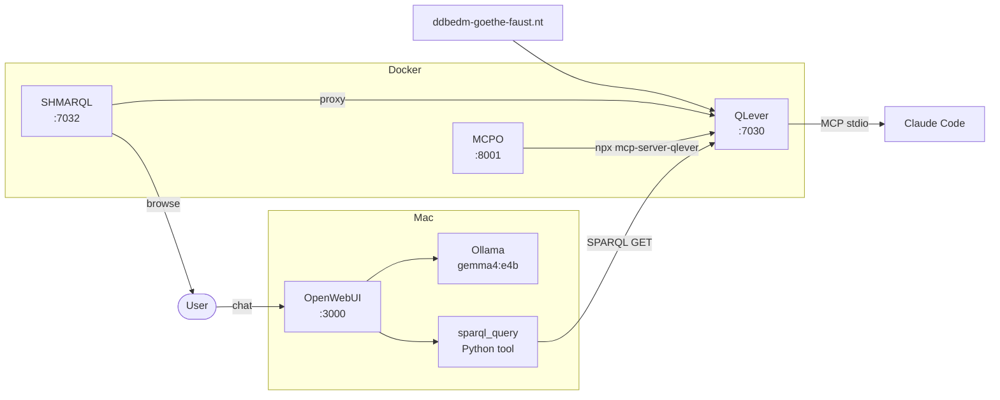
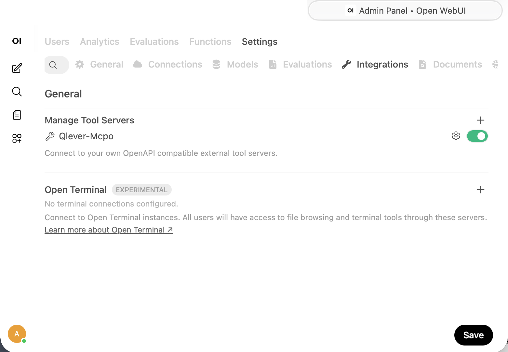

# Goethe-Faust — SPARQL Setup

DDB EDM dataset (8.6M triples) served via QLever, with SHMARQL as UI
and `mcp-server-qlever` for Claude Code and OpenWebUI access.



## Prerequisites

- Docker + Docker Compose plugin
- `output/ddbedm-goethe-faust.nt` (1.3 GB) — copy from source or
  re-run the pipeline to generate it

## Configuration

Copy the example config and edit as needed:

```bash
cp config.env.example config.env
```

Key settings in `config.env`:

| Variable | Default | Description |
|----------|---------|-------------|
| `NT_INPUT` | `output/ddbedm-goethe-faust.nt` | Single `.nt` file or directory |
| `QLEVER_PORT` | `7030` | QLever SPARQL endpoint port |
| `SHMARQL_PORT` | `7032` | SHMARQL UI + SPARQL port |
| `MCPO_PORT` | `8001` | MCPO (MCP→HTTP bridge) port |
| `INDEX_DIR` | `data/qlever-index` | Persisted QLever binary index |
| `LOG_DIR` | `data/logs` | Log output directory |
| `INDEX_NAME` | `goethe-faust` | Base name for index files |
| `QLEVER_MEMORY` | `4GB` | Memory cap for QLever server |

## Start

```bash
./setup.sh up
```

First run builds the QLever index (~few minutes). Subsequent runs
start in seconds — the index is persisted in `$INDEX_DIR`.

## Services

| Service | URL | Description |
|---------|-----|-------------|
| SHMARQL | http://localhost:7032 | UI + SPARQL, backed by QLever |
| QLever  | http://localhost:7030 | Raw SPARQL endpoint |
| MCPO    | http://localhost:8001 | MCP→HTTP bridge for OpenWebUI |

All defined in `docker-compose.qlever.yml`.

## Check status

```bash
./check.sh
```

Reports which services are running and offers to continue setup
interactively (register MCP with Claude Code, start MCPO, print
the OpenWebUI Tools URL).

## MCP — Claude Code

Register once after `./setup.sh up`:

```bash
./setup.sh mcp-add
```

Or run `./check.sh` — it will detect if MCP is unregistered and prompt.

## MCP — OpenWebUI (browser chat)

MCPO exposes the MCP server as an HTTP tool endpoint for OpenWebUI.

**This server (Server B):** start MCPO:

```bash
docker compose -f docker-compose.qlever.yml --env-file .env.runtime \
  up -d mcpo
```

Or run `./check.sh` — it will detect MCPO is down and offer to start it,
then print the Tools URL.

**Mac / Server A:** install Ollama natively (Docker does not expose
Apple Silicon GPU to containers), pull the model, then start OpenWebUI:

```bash
# Install from https://ollama.com/download or:
brew install ollama
ollama pull gemma4:e4b

docker compose -f docker-compose.openwebui.yml up -d
```

Open http://localhost:3000, create an admin account, then go to
**Admin → Integrations → Manage Tool Servers** and add:

```
http://<THIS_SERVER_IP>:8001
```

The entry will appear as **Qlever-Mcpo** with a green toggle
when connected.



(Run `./check.sh` on this server to get the exact URL.)

> **Note**: MCPO tool servers are not reliably invoked by Ollama
> (known upstream bug). Also add the native Python tool:
> **Workspace → Tools → +** → paste `scripts/openwebui-sparql-tool.py`.
> See `notes/troubleshooting-mcpo.md` for details.

## Other commands

```bash
./setup.sh down              # stop all services
./setup.sh status            # show container status
./setup.sh logs qlever       # tail QLever logs (also writes to $LOG_DIR)
./setup.sh logs shmarql      # tail SHMARQL logs (also writes to $LOG_DIR)
```

## Transferring to another server

1. Copy this directory (including `output/ddbedm-goethe-faust.nt`)
2. Edit `config.env` if needed
3. Run `./setup.sh up`
