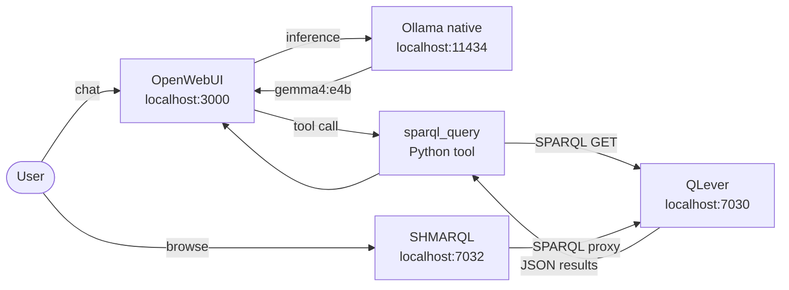

# OpenWebUI + Ollama + Gemma 4 setup

Browser chat that queries QLever via a native SPARQL tool.



## Prerequisites

MCPO must be running:

```bash
curl -s http://localhost:8001/openapi.json \
  | python3 -c "import sys,json; \
    d=json.load(sys.stdin); \
    print(len(d['paths']), 'tools available')"
```

If MCPO is down: `./setup.sh up`

## Step 1 — Install Ollama (native)

Ollama must run natively — Docker Desktop does not expose
Apple Silicon GPU (Metal) to containers.

```bash
brew install ollama
```

Or download from https://ollama.com/download (pkg installer).

Start the Ollama server:

```bash
ollama serve
```

Ollama runs on `http://localhost:11434` by default. On macOS it
also runs as a menu bar app after install.

## Step 2 — Pull Gemma 4

```bash
ollama pull gemma4:e4b
```

Download size: ~9.6 GB (one-time). Requires ~6–8 GB RAM at
inference time. Fits on M4 base (16 GB unified memory).

Verify:

```bash
ollama list
# gemma4:e4b should appear
```

## Step 3 — Start OpenWebUI

```bash
cd goethe-faust
docker compose -f docker-compose.openwebui.yml up -d
```

Open http://localhost:3000

## Step 4 — First-time OpenWebUI config

1. Create an admin account (first account = admin)
2. Go to **Admin → Integrations → Manage Tool Servers**
3. Add tool server URL:

   ```
   http://localhost:8001
   ```

   (If running MCPO on a different server, use its IP instead.)

4. Select model: **gemma4:e4b**

## Step 5 — Add the native SPARQL tool

MCPO tool servers are not reliably invoked by Ollama (known
OpenWebUI bug). Use a native Python tool instead — it shows up
in the ◈ chat menu and works with any Ollama model.

1. Go to **Workspace → Tools → +**
2. Paste the contents of `scripts/openwebui-sparql-tool.py`
3. Click **Save**
4. In a chat, click **◈** → enable **QLever SPARQL Query**
5. Test:

   ```
   How many triples are in the dataset?
   ```

See `openwebui-native-tool.md` for full details and
`troubleshooting-mcpo.md` for why MCPO alone is insufficient.

## Verification

```bash
# Ollama responding with model available
curl -s http://localhost:11434/api/tags \
  | python3 -c "import sys,json; \
    [print(m['name']) \
    for m in json.load(sys.stdin)['models']]"
# expect: gemma4:e4b

# OpenWebUI up
curl -sf http://localhost:3000 -o /dev/null && echo OK

# MCPO tools count
curl -s http://localhost:8001/openapi.json \
  | python3 -c "import sys,json; \
    d=json.load(sys.stdin); \
    print(len(d['paths']), 'tools')"
```

## Stopping

```bash
docker compose -f docker-compose.openwebui.yml down
# Ollama: quit the menu bar app, or:
pkill ollama
```
