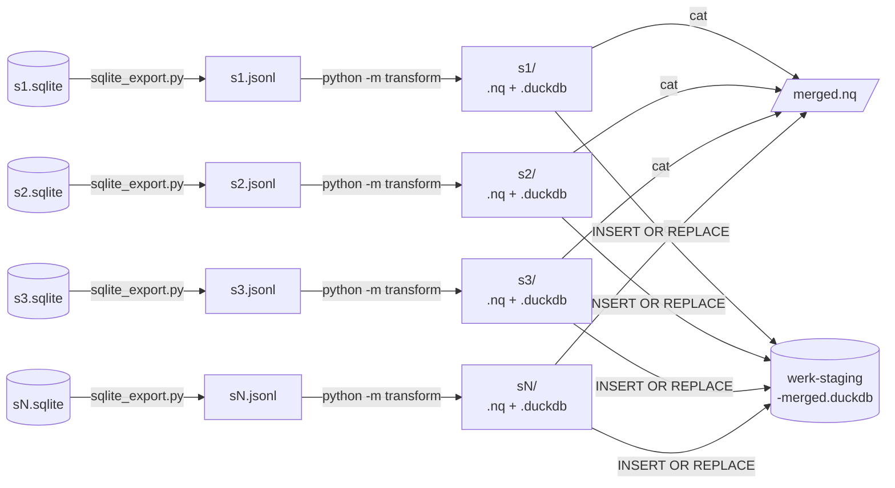

# transform-dryrun-plan.md

Planning notes for running `transform_edm_to_mocho.py` on the full GeMeA corpus
(`gemea/data/sqlite/s2.sqlite`, 18,570,245 records).

---

## 0. Pipeline overview

One SQLite file per sector (`s1.sqlite` … `s7.sqlite`). Each sector runs independently.



Steps:
1. **Export** (`sqlite_export.py`) — sequential scan of each `sN.sqlite` → one JSONL per sector
2. **Transform** (`python -m transform`) — one worker per sector, all in parallel
3. **Merge** — `cat` N-Quads shards; DuckDB `INSERT OR REPLACE` across staging files

---

## 1. Parallelizability

`transform_record()` is stateless (pure dispatch over immutable lookup tables), so
the transform is embarrassingly parallel. Three things serialize the current run:

| Bottleneck | Problem | Solution |
|---|---|---|
| Single `.nq` output file | one writer | one shard per worker, then `cat` |
| Single DuckDB connection | one writer at a time | one `.duckdb` per worker, merge after |
| Single JSONL stream | linear read | pre-split input into N chunks |

**Simplest approach — no code changes:**

```bash
# split input into 4 chunks (adjust for CPU count)
split -l 4642561 /tmp/s2-full.jsonl /tmp/chunk_

# run workers in parallel
for f in /tmp/chunk_*; do
  python -m transform --jsonl $f --outdir output/transform/parallel/$(basename $f) &
done
wait

# merge .nq shards (order doesn't matter for N-Quads)
cat output/transform/parallel/chunk_*/*.nq > output/transform/merged.nq

# merge DuckDB staging tables
python3 - <<'EOF'
import duckdb, glob
conn = duckdb.connect("output/transform/merged-werk-staging.duckdb")
shards = sorted(glob.glob("output/transform/parallel/chunk_*/*-werk-staging.duckdb"))
conn.execute(f"CREATE TABLE werk_staging AS SELECT * FROM '{shards[0]}'")
for p in shards[1:]:
    conn.execute(f"INSERT OR REPLACE INTO werk_staging SELECT * FROM '{p}'")
conn.close()
EOF
```

**Note on scale**: at ~5,000–10,000 records/sec in pure Python, 18.5M records
≈ 30–60 min single-threaded. Parallelism is worthwhile at full-corpus scale.

---

## 2. Inputs and prerequisites

### 2.1 Data source

| File | Path | Notes |
|---|---|---|
| SQLite corpus | `gemea/data/sqlite/s2.sqlite` | 18.5M rows; `objs(uid PK, download_timestamp, bufgz BLOB)` |
| ID list | `gemea/data/sqlite/ids_sec_02_digitalisat.txt` | 18.5M UIDs (full corpus) |
| Schema reference | `gemea/data/sqlite/sqlite_schema.json` | saved schema + top-level key list |

Records are gzip-compressed JSON in `bufgz`; decompress with `gzip.decompress()`.
Top-level keys match goethe-faust JSONL: `properties`, `provider-info`, `edm`,
`source`, `binaries`, etc.

### 2.2 Config files

All live in `goethe-faust/output/config/`. Pass explicitly via CLI flags when
running from outside the goethe-faust root:

| Flag | File |
|---|---|
| `--alignment` | `lookup_class_prop_alignment.csv` |
| `--lido` | `lido_event_types.csv` |
| `--htype` | `lookup_htype_doco_rico.csv` |
| `--mediatype` | `lookup_mediatype_class.csv` |
| `--audio` | `audio_type2class.json` |

### 2.3 Python dependency

```bash
pip install duckdb
```

---

## 3. Dry-run workflow (Option C — temp JSONL)

No code changes required. Export a slice of records to a temp JSONL file, run the
transform, inspect output, delete the temp file.

### 3.1 Extract a sample from SQLite

```python
# scripts/extract_sqlite_sample.py
# Purpose:  Export N records from s2.sqlite to JSONL for transform dry-run.
# Usage:    python extract_sqlite_sample.py [--ids FILE] [--limit N] [--out FILE]
# Inputs:   gemea/data/sqlite/s2.sqlite
# Outputs:  /tmp/s2-sample.jsonl (or --out path)
# Deps:     stdlib only

import argparse, gzip, json, sqlite3
from pathlib import Path

parser = argparse.ArgumentParser()
parser.add_argument("--db",    default="gemea/data/sqlite/s2.sqlite")
parser.add_argument("--ids",   default="gemea/data/sqlite/ids_sec_02_digitalisat.txt")
parser.add_argument("--limit", type=int, default=500)
parser.add_argument("--out",   default="/tmp/s2-sample.jsonl")
args = parser.parse_args()

conn = sqlite3.connect(args.db)
written = 0
with open(args.ids) as id_file, open(args.out, "w") as out:
    for line in id_file:
        uid = line.strip()
        if not uid:
            continue
        row = conn.execute("SELECT bufgz FROM objs WHERE uid = ?", (uid,)).fetchone()
        if row:
            print(json.dumps(json.loads(gzip.decompress(row[0])), ensure_ascii=False),
                  file=out)
            written += 1
        if written >= args.limit:
            break
conn.close()
print(f"Wrote {written} records to {args.out}")
```

Run from `goethe-faust/` root (so relative paths to `gemea/` resolve):

```bash
cd /Users/mta/Documents/claude
python goethe-faust/scripts/extract_sqlite_sample.py --limit 500 --out /tmp/s2-sample.jsonl
```

### 3.2 Run the transform

```bash
cd /Users/mta/Documents/claude/goethe-faust
python -m transform \
  --jsonl /tmp/s2-sample.jsonl \
  --stats dispatch \
  --limit 100
```

Output lands in `output/transform/YYYYMMDD_HHMMSS/`:

```
s2-sample.nq                    N-Quads (all named graphs)
s2-sample-werk-staging.duckdb
s2-sample-stats.json            dispatch breakdown
s2-sample-errors.jsonl          per-record errors (if any)
s2-sample.log
```

### 3.3 Validate

Key things to check in `transform_stats.json`:

- `records.errors.transform` — should be 0 or near-0
- `dispatch.fallback_d9` — high fallback rate signals missing dc:type mappings
- `dispatch.manifestation_classes` — distribution should look plausible for sparte002 (Library)
- `werk_staging.rows` — W-slot staging rows (Werke) populated correctly

### 3.4 Clean up

```bash
rm /tmp/s2-sample.jsonl
```

---

## 4. Dry-run results (2026-05-06)

Run directory: `output/transform/20260506_092842/`

### 4.1 Execution

| Step | Command | Time |
|---|---|---|
| Extract 500 records from SQLite | `python scripts/extract_sqlite_sample.py --limit 500` | 0.4 s |
| Transform | `python -m transform --jsonl /tmp/s2-sample.jsonl --stats dispatch` | ~0.1 s |

Run from `goethe-faust/` with `PYTHONPATH=scripts`.

### 4.2 Stats

```json
{
  "records": { "processed": 500, "errors": { "json_parse": 0, "transform": 0 } },
  "triples": {
    "total": 53105,
    "by_graph": { "ddbedm": 28776, "mocho": 9860, "prov": 14469 }
  },
  "werk_staging": { "rows": 0 },
  "dispatch": {
    "htype_hits": 6,
    "mediatype_hits": 494,
    "fallback_d9": 0,
    "manifestation_classes": {
      "mocho:Manifestation":      487,
      "mocho:ImageManifestation":   7,
      "doco:Figure":                6
    }
  }
}
```

### 4.3 Verdict

**Pass** — 0 parse errors, 0 transform errors, 0 fallback hits. The pipeline
handles GeMeA/s2.sqlite records identically to the goethe-faust corpus. Record
structure and Concept IRIs (mediatype/sector) are compatible.

- 106 triples/record average; 19.7 mocho triples/record
- `mocho:Manifestation` dominates (97%) — expected for sparte002 + mt003 records
  without a dc:type that maps to a more specific M-slot class
- No W-slot classes in this 500-record sample (werk_staging empty)

---

## 5. Input strategy: Option B vs. Parallelizable Option C

### 5.1 Option B (add `--sqlite` to `__main__.py`)

Replace the JSONL file iterator with a SQLite cursor. Small code change, no temp
file. For sector processing: add a `--sector` filter or pass a per-sector ID list.

**Trade-off**: Option B removes the intermediate file but does not change throughput.
The bottleneck at scale is Python per-record speed (gzip decompress + JSON parse +
transform), not I/O method. Random SQLite lookups by UID are also slower than
sequential JSONL reads at 18.5M scale, especially if IDs are not in insertion order.

### 5.2 Option C parallel (decided)

Export per-sector JSONL files from SQLite once, then run N transform workers in
parallel — one per sector or one per chunk. No code changes to the transform.

**Why over Option B:**

| Criterion | Option B (`--sqlite`) | Option C parallel |
|---|---|---|
| Temp file | No | Yes (per-sector JSONL) |
| Code changes | Yes (`__main__.py`) | None |
| Read speed | Random UID lookups (slower) | Sequential file read (faster) |
| Parallelism | ID-list pre-split needed | Sector split is natural boundary |
| Sector isolation | Needs SQL filter | One file per sector |
| Re-runs | Re-queries SQLite each time | Re-reads JSONL (or re-exports) |

Sequential JSONL reads benefit from OS page cache warmup; per-UID SQLite access at
18.5M scale does not. For bulk sector processing the export cost is paid once; the
transform can be re-run on the same JSONL without re-touching the SQLite.

---

## 6. Full-corpus run plan (Parallelizable Option C)

### 6.1 Step 1 — Export each sector SQLite to JSONL

One `sN.sqlite` per sector — sequential full-table scan, no routing needed.
`sqlite_export.py` (transform package module):

```bash
GEMEA=gemea/data/sqlite
EXPORT=/tmp/gemea-export

for n in 1 2 3 4 5 6 7; do
  PYTHONPATH=goethe-faust/scripts python -m transform.sqlite_export \
    --db  $GEMEA/s${n}.sqlite \
    --out $EXPORT/s${n}.jsonl &
done
wait
```

### 6.2 Step 2 — Export + transform pipelined per sector

Each sector runs in its own subshell: export finishes, then transform starts
immediately — no waiting for other sectors. All 7 subshells run in parallel.

```bash
GOETHE=goethe-faust
CFG=$GOETHE/output/config
GEMEA=gemea/data/sqlite
EXPORT=/tmp/gemea-export

for n in 1 2 3 4 5 6 7; do
  (
    PYTHONPATH=$GOETHE/scripts python -m transform.sqlite_export \
      --db  $GEMEA/s${n}.sqlite \
      --out $EXPORT/s${n}.jsonl \
    && \
    PYTHONPATH=$GOETHE/scripts python -m transform \
      --jsonl   $EXPORT/s${n}.jsonl \
      --outdir  $GOETHE/output/transform/gemea/s${n} \
      --stats dispatch \
      --alignment $CFG/lookup_class_prop_alignment.csv \
      --lido      $CFG/lido_event_types.csv \
      --htype     $CFG/lookup_htype_doco_rico.csv \
      --mediatype $CFG/lookup_mediatype_class.csv \
      --audio     $CFG/audio_type2class.json
  ) &
done
wait
```

### 6.3 Step 3 — Merge outputs

```bash
# merge N-Quads
cat $GOETHE/output/transform/gemea/s*/goethe-faust.nq > $GOETHE/output/transform/gemea/merged.nq

# merge DuckDB staging
python3 - <<'EOF'
import duckdb, glob
shards = sorted(glob.glob("goethe-faust/output/transform/gemea/s*/goethe-faust-werk-staging.duckdb"))
conn = duckdb.connect("goethe-faust/output/transform/gemea/werk-staging-merged.duckdb")
conn.execute(f"CREATE TABLE werk_staging AS SELECT * FROM '{shards[0]}'")
for p in shards[1:]:
    conn.execute(f"INSERT OR REPLACE INTO werk_staging SELECT * FROM '{p}'")
conn.close()
EOF
```

### 6.4 Estimated runtime

| Phase | Time estimate |
|---|---|
| SQLite → JSONL export (single pass, all sectors) | 30–60 min |
| Transform, 7 workers in parallel | 15–30 min |
| Merge | < 1 min |
| **Total** | **~1–1.5 h** |

Single-threaded transform alone would be 30–60 min; sector parallelism roughly
divides by the number of sectors running concurrently (up to 7).
