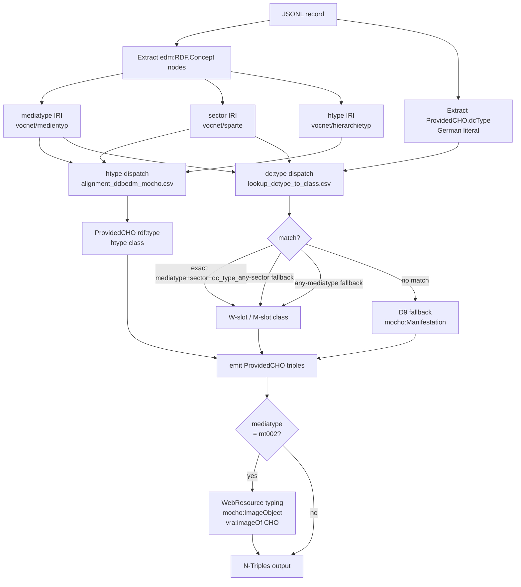

# Plan: Complete the goethe-faust Transform Pipeline

## 0. Context

Note reorganisation (§2 of prior plan) is **complete**:
- ✅ `alignment-plan.md` → `transform-plan.md`
- ✅ `alignment-adr.md` → `transform-adr.md`
- ✅ `transform-pseudocode.md` deleted
- ✅ Cross-references updated in `goethe-faust/.claude/CLAUDE.md`, `mocho/notes/alignment-ddbedm-mocho-adr.md`, `image-type-class-mapping.md` §6, `babel-ddb/.claude/CLAUDE.md`
- ✅ `audio-type-class-mapping.md` written (MO/ACO class justification; GND URI future path)
- ✅ `image-type-class-mapping.md` written

**Current note inventory (goethe-faust/notes/)**:

| File | Role | Status |
|---|---|---|
| `transform-plan.md` | Transform implementation plan | Approved |
| `transform-adr.md` | Transform ADR (D1–D12) | Accepted |
| `transform-script-plan.md` | Dispatch table plan (Phase A done; B–D pending) | In progress |
| `audio-type-class-mapping.md` | AUDIO dispatch model (MO/ACO groups A–C) | Done |
| `image-type-class-mapping.md` | IMAGE dispatch model (D11–D12) | Done |
| `video-type-class-mapping.md` | VIDEO type class justification | Done |
| `inputs.md` | Input file descriptions | Done |

**Remaining work**: transform pipeline Phases B–D + `dnb_uri` additions.

---

## 1. Transform Pipeline — Overview



---

## 3. What is unfinished in the goethe-faust transform

The goethe-faust POC transform (`transform_edm_to_mocho.py`) currently:
- ✅ D1–D10: JSONL streaming, alignment table, htype dispatch, mocho:Manifestation base type
- ✅ D11–D12 (config): `image_type2class.json` updated with new dispatch groups
- ✅ Phase B0: `count_dctype_gnd_coverage.py` written and run → see observations below
- ✅ Phase B: `gen_dctype_class_mapping.py` written → `lookup_dctype_to_class.csv` (1,647 rows; no fabio classes)
- ✅ Phase C: `sample_type_dispatch.py` written → 76.0% matched; Photo 100% exact; no fabio emitted
- ❌ Phase D: `transform_edm_to_mocho.py` not updated to use the lookup CSV or type WebResources

### 3.0 Phase B0 — `count_dctype_gnd_coverage.py` ✅

**Observations (run on 115,432 records, 2026-04-18; GND + Getty AAT)**:

92,853 records (80.4%) have a dc:type value. **48.5% of dc:type occurrences have a
controlled-vocabulary URI** (GND or Getty AAT) via Concept.prefLabel → Concept.about.
1,033 unique dc:type values; 356 with vocab URI (237 GND, 119 Getty AAT), 677 without.

The earlier figure of 98.8% was incorrect — it counted non-vocabulary concept URIs
(internal DDB identifiers such as `AVTKN75244...`) as matches. The script now accepts
only `d-nb.info/gnd/` (GND) and `vocab.getty.edu/aat/` (Getty AAT) URIs, skipping all
other concept `about` values.

| Mediatype | Sector | Total | Vocab URI | % |
|---|---|---|---|---|
| Audio | Archive | 8 | 8 | 100% |
| Audio | Library | 12 | 12 | 100% |
| Audio | Research | 22 | 22 | 100% |
| Audio | Media Library | 424 | 423 | 99.8% |
| Audio | Museum | 10 | 0 | 0% |
| Photo | Archive | 5,129 | 4,538 | 88.5% |
| Photo | Library | 984 | 846 | 86.0% |
| Photo | Monument | 97 | 0 | 0% |
| Photo | Research | 948 | 508 | 53.6% |
| Photo | Media Library | 3,792 | 3,208 | 84.6% |
| Photo | Museum | 8,972 | 7,598 | 84.7% |
| Photo | Others | 74 | 39 | 52.7% |
| Text | Archive | 23,024 | 413 | 1.8% |
| Text | Library | 19,996 | 13,107 | 65.5% |
| Text | Research/Media Library/Museum/Others | 288 | 2 | ~1% |
| Video | Archive | 7 | 7 | 100% |
| Video | Library/Media Library/Museum | 89 | 0 | 0% |
| Not Digitized | Archive | 17,320 | 5,551 | 32.0% |
| Not Digitized | Library | 11,359 | 8,733 | 76.9% |
| Not Digitized | Monument/Research/Media Library/Museum | 279 | 42 | ~15% |

Outputs: `output/dctype_gnd_coverage.csv` (per mediatype/sector/dc_type_de),
`output/dctype_to_gnd_uri.csv` (356 rows; GND preferred over Getty; source for `dnb_uri` column),
`output/vocab_coverage_summary.csv` (29 rows; aggregated table above — produced by `summarise_vocab_coverage.py`).

**Conclusion**: Controlled-vocabulary dispatch (Option 1) covers 48.5% of dc:type
occurrences and 34% of unique dc:type strings. Coverage is strong for Photo/Museum,
Audio/Media Library, and Text/Library sectors; near-zero for Text/Archive and Video.
`dc_type_de` string lookup remains the primary dispatch key. The `dnb_uri` column
preserves the 356 confirmed vocab URIs (GND preferred, Getty AAT as fallback) for
future use; left empty for the remaining 677 dc:types.

### 3.1 Phase B — `gen_dctype_class_mapping.py`

Reads all four config JSONs (audio, image, video, general) and writes
`output/config/lookup_dctype_to_class.csv`. Schema (updated to include `dnb_uri`):

| Column | Description |
|---|---|
| `mediatype` | IRI or `any` |
| `sector` | IRI or `any` |
| `dc_type_de` | German dc:type literal (current lookup key) |
| `dc_type_en` | English translation |
| `dnb_uri` | Controlled-vocabulary URI (GND preferred, Getty AAT fallback) from corpus Concept nodes (future lookup key — Option 1 path) |
| `rdf_type_w` | Work-level class IRI |
| `rdf_type_e` | Expression-level class IRI |
| `rdf_type_m` | Manifestation-level class IRI |
| `rdf_type_i` | Item-level class IRI |
| `source_vocab` | `mo`, `aco`, `vra`, `mocho`, `rico`, `ebucoreplus`, etc. |
| `notes` | from config `notes` field |

**`dnb_uri` rationale**: dc:type is a German free-text literal — fragile as a long-term
lookup key. The corpus Concept nodes already carry controlled-vocabulary URIs via
`Concept.prefLabel` → `Concept.about`: GND Sachbegriffe (`d-nb.info/gnd/`, 237 dc:types)
and Getty AAT (`vocab.getty.edu/aat/`, 119 dc:types). These 356 URIs are exported to
`dctype_to_gnd_uri.csv` (GND preferred when both exist) and carried forward into the
`dnb_uri` column of `lookup_dctype_to_class.csv`. Coverage: 48.5% of occurrences,
34% of unique dc:types. Future work: extend coverage by lobid-gnd/Getty lookup for
the remaining 677 dc:types; then key dispatch on `dnb_uri` rather than `dc_type_de`.

**CLASS_MAP additions** for mt002 new classes (add to `gen_dctype_class_mapping.py`):
```python
"vra:Work":            "http://purl.org/vra/Work",
"mocho:ImageWork":     "https://ise-fizkarlsruhe.github.io/ddbkg/mocho#ImageWork",
"mocho:ImmovableWork": "https://ise-fizkarlsruhe.github.io/ddbkg/mocho#ImmovableWork",
"mocho:ImageObject":   "https://ise-fizkarlsruhe.github.io/ddbkg/mocho#ImageObject",
"mocho:Manifestation": "https://ise-fizkarlsruhe.github.io/ddbkg/mocho#Manifestation",
```

### 3.2 Phase C — `sample_type_dispatch.py`

Reads the JSONL and the lookup CSV; for a sample of records per (mediatype, sector)
cell, prints the dispatch result. Used to empirically validate the dispatch model
before modifying the transform.

### 3.3 Phase D — Update `transform_edm_to_mocho.py`

Two changes to `retype_entities()`:

**D.1 — dc:type dispatch for ProvidedCHO**

**Mediatype and sector paths in the EDM graph** (validated against `data/items-excerpt-1000.json`):

```
# Mediatype — dc:type is on the WebResource, not the CHO
<cho>  ←──edm:aggregatedCHO──  <aggregation>
                                      │
                               edm:isShownBy
                                      │
                                      ▼
                              <web-resource>  (edm.RDF.WebResource[].type.resource)
                                      │
                                  dc:type
                                      │
                                      ▼
                              <vocnet-mt:mt003>  rdf:type  skos:Concept

# Sector — edm:type is on the Agent/Organization, not the CHO
<cho>  ←──edm:aggregatedCHO──  <aggregation>
                                      │
                              edm:dataProvider
                                      │
                                      ▼
                              <organization>  (edm.RDF.Agent[].type.resource)
                                      │
                                   edm:type
                                      │
                                      ▼
                              <ddbsparte:sparte002>  rdf:type  skos:Concept
```

Both vocnet IRIs also appear as flat `Concept` nodes (`edm.RDF.Concept[].about`) — this is the extraction point used by `_extract_mediatype_sector()`. Neither is a direct triple on the ProvidedCHO; the transform bridges the gap by asserting `rdf:type` directly (D9 approach).

Load `lookup_dctype_to_class.csv` at startup (alongside htype CSV).
In `retype_entities()`, after the htype dispatch:
1. Extract mediatype + sector from the record's `edm.RDF.Concept` list
2. Extract dc:type from `ProvidedCHO.dcType`
3. Lookup (mediatype, sector, dc_type_de) → class row (three-level fallback: exact → any-sector → any-mediatype)
4. If W-slot class found: emit W-slot class **instead of** `mocho:Manifestation`
5. If M-slot class found: emit M-slot class **alongside** `mocho:Manifestation` (accumulation)
6. If no match: D9 fallback (`mocho:Manifestation` only)
7. Htype dispatch is independent — both layers can fire for the same record

**D.2 — WebResource typing for mt002**

After ProvidedCHO triples, for records where `mediatype = mt002`:
- Get WebResource URIs from `edm:isShownBy` and `edm:hasView`
- Emit for each WebResource URI:
```turtle
<wr-uri> a mocho:ImageObject ;
         a rdac:C10007 ;
         rdam:P30001 rdact:1018 ;
         vra:imageOf <cho-uri> .
```

---

## 3.4 Phase B0 — `count_dctype_gnd_coverage.py` (prerequisite for dnb_uri)

**Purpose**: measure what fraction of dc:type values in the corpus have a corresponding
GND URI via `edm.RDF.Concept`, and export the `dc_type_de → GND URI` mapping for use
as the `dnb_uri` column in `lookup_dctype_to_class.csv`.

**Lookup logic**: `ProvidedCHO.dcType` value → search `edm.RDF.Concept[]` for
case-insensitive `prefLabel` match → `Concept.about` is the GND URI.
Concept list also contains mediatype/sector IRIs (vocnet namespace) — skip those.

**Inputs**: `data/items-all-goethe-faust.json` (streaming)

**Outputs**:
1. `output/dctype_gnd_coverage.csv` — per (mediatype, sector, dc_type_de):
   `count`, `gnd_uri` (first GND match, empty if none), `has_gnd` (bool)
2. `output/dctype_to_gnd_uri.csv` — deduplicated `dc_type_de → gnd_uri` mapping
   (one row per unique dc_type_de; for populating `dnb_uri` in the lookup CSV)
3. Printed summary: per mediatype/sector — total dc:type occurrences, matched count, % coverage

**Implementation notes**:
- `dcType` may be a string or list → normalise to list
- `Concept.prefLabel` may be a string or list → normalise to list; match case-insensitively
- Skip Concepts with `about` in `ddb.vocnet.org/medientyp/` or `ddb.vocnet.org/sparte/`
- Prefer `d-nb.info/gnd/` URIs; if multiple Concepts match a dcType string, take first GND URI
- Mediatype and sector extracted from Concept list filtered by vocnet namespace IRIs
- stdlib only: `json`, `csv`, `pathlib`, `collections`

---

## 4. Files to modify

### Notes (pending)

| File | Action |
|---|---|
| `goethe-faust/notes/transform-edm2mocho-plan.md` | ✅ This file |
| `goethe-faust/notes/audio-type-class-mapping.md` | ✅ Added GND URI dispatch note to §3 open questions |
| `goethe-faust/notes/transform-script-plan.md` | Update §2 CSV schema to add `dnb_uri` column; mark phases B–D complete when done |
| `goethe-faust/notes/providedcho-property-mapping.md` | **New** — human-readable reference: edm:ProvidedCHO property → mocho/RDA predicate (extracted from `alignment_ddbedm_mocho.csv`) |

### Transform pipeline completion

| File | Action |
|---|---|
| `goethe-faust/scripts/count_dctype_gnd_coverage.py` | ✅ Phase B0 |
| `goethe-faust/output/dctype_gnd_coverage.csv` | ✅ Generated by Phase B0 |
| `goethe-faust/output/dctype_to_gnd_uri.csv` | ✅ Generated by Phase B0 |
| `goethe-faust/scripts/gen_dctype_class_mapping.py` | **New** — Phase B |
| `goethe-faust/output/config/lookup_dctype_to_class.csv` | **New** — generated by Phase B |
| `goethe-faust/scripts/sample_type_dispatch.py` | **New** — Phase C |
| `goethe-faust/scripts/transform_edm_to_mocho.py` | **Update** — Phase D.1 (dc:type dispatch + WebResource typing); Phase D.2 (property completeness — see §3.4) |
| `goethe-faust/scripts/README.md` | ✅ Updated |

### 3.4 Phase D.2 — Property alignment completeness

After dc:type dispatch (D.1), verify that `transform_edm_to_mocho.py` emits all
`edm:ProvidedCHO` properties that have a mocho/RDA mapping in
`output/alignment_ddbedm_mocho.csv`. Steps:

1. Extract all ProvidedCHO properties from `alignment_ddbedm_mocho.csv`
   (filter `entity_type = ProvidedCHO`; keep rows where `in_mocho = True`)
2. Cross-check against properties currently handled in `transform_edm_to_mocho.py`
3. For each gap (mapped but not emitted): add emission logic or document as
   intentional deferral in `transform-adr.md`
4. Update `providedcho-property-mapping.md` with status column (emitted / deferred / TBD)

**Note**: `providedcho-property-mapping.md` is the human-readable companion to
`alignment_ddbedm_mocho.csv` — it shows only ProvidedCHO properties, with the
mocho/RDA predicate, WEMI level, and current emit status in the transform.

---

## 5. Verification

1. All four `*_type2class.json` configs exist and are non-empty
2. Run `gen_dctype_class_mapping.py` → `lookup_dctype_to_class.csv` exists, no TBD IRIs
3. Run `sample_type_dispatch.py` → spot-check: `Zeichnung/sparte006` → `vra:Work`; `Fotografie/sparte005` → `mocho:ImageWork`
4. Run `transform_edm_to_mocho.py` → check stats: `objects_missing_specific_type` reduced for mt002 records
5. Grep NT output: museum Zeichnung record has `vra:Work`, not `mocho:Manifestation`
6. Grep NT output: mt002 WebResource URI has `mocho:ImageObject` + `vra:imageOf`
7. No broken cross-references to old `alignment-plan.md` / `alignment-adr.md` filenames
