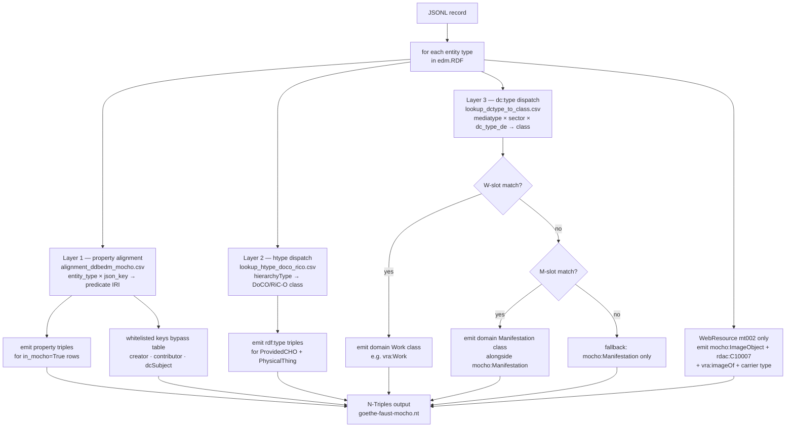

# Transform writeup: EDM → mocho N-Triples

## 1. Input structure

Each record in `data/items-all-goethe-faust.json` is one DDB cultural object (JSONL, one record per line):

```
edm.RDF
  ├── ProvidedCHO      ← the cultural object itself (title, creator, date, dc:type …)
  ├── WebResource      ← digital file URL(s)
  ├── PhysicalThing    ← archival containers (folder, box, fonds …)
  ├── Aggregation      ← Europeana aggregation metadata
  └── Concept[]        ← controlled-vocab terms: mediatype, sector, dc:type concepts
```

---

## 2. Three mapping layers



### 2.1 Property alignment (all entity types)

**File**: `output/alignment_ddbedm_mocho.csv`

For each entity (ProvidedCHO, WebResource, Aggregation …), the transform iterates its JSON keys and looks up `(entity_type, json_key)` in the alignment CSV. Each match gives one or more RDA predicate IRIs. Only rows where `in_mocho = True` are used.

Example: `ProvidedCHO.dcTitle` → `rdaw:P10088` (has title of work)

Three keys get special treatment (bypass the table):

| Key | Predicate | Reason |
|---|---|---|
| `creator` | `rdam:P30263` "has creator agent of manifestation" | Table had 464 overly-specific candidates; generic Manifestation-level property used |
| `contributor` | `dc:contributor` | No generic RDA equivalent in mocho's current import |
| `dcSubject` / `dcTermsSubject` / `dcTermSubject` | `dcterms:subject` (IRI values) or `dc:subject` (literals) | Three keys carry overlapping data; deduplicated before emit |

### 2.2 `rdf:type` via hierarchyType (htype)

**File**: `output/lookup_htype_doco_rico.csv`  
**Reference**: `mocho/notes/archival-objects.md`

DDB archival records divide into two structural zones:

- **Tektonik** — the physical archive hierarchy (Repository → Bestand), carried as `PhysicalThing` ancestors
- **Findbuch** — the finding-aid hierarchy (Gliederung → Teil), carried as `PhysicalThing` ancestors or as the `ProvidedCHO` itself

`PhysicalThing.hierarchyType` and `ProvidedCHO.hierarchyType` carry codes (`htype_030`–`htype_048`). The transform treats them differently:
- `ProvidedCHO` → `mocho:Manifestation` + dc:type dispatch (Layer 2.3) + optional htype-derived RiC-O class
- `PhysicalThing` ancestors → htype-derived RiC-O class only; no `mocho:Manifestation`

**htype → RiC-O mapping**

| htype | DE label | EN label | rdf:type | rico:hasRecordSetType (standard) | rico:hasRecordSetType (DDB-specific) |
|---|---|---|---|---|---|
| htype_048 | Tektonische Sammlung | Tektonik Collection | `rico:RecordSet` | `ric-rst:Collection` | `vocnet-htype:ht048` |
| htype_037 | Bestand Klassifikation | Holding Classification | `rico:RecordSet` | `ric-rst:Collection` | `vocnet-htype:ht037` |
| htype_036 | Bestandsserie | Holding Series | `rico:RecordSet` | `ric-rst:Collection` | `vocnet-htype:ht036` |
| htype_030 | Bestand | Holding | `rico:RecordSet` | `ric-rst:Fonds` | `vocnet-htype:ht030` |
| htype_031 | Gliederung | Classification | `rico:RecordSet` | `ric-rst:Series` | `vocnet-htype:ht031` |
| htype_032 | Serie | Series | `rico:RecordSet` | `ric-rst:Series` | `vocnet-htype:ht032` |
| htype_033 | Unterserie | Sub-Series | `rico:RecordSet` | `ric-rst:Series` | `vocnet-htype:ht033` |
| htype_034 | Archivale | File | `rico:Record` | — | — |
| htype_035 | Teil | Part | `rico:RecordPart` | — | — |

For `rico:RecordSet` nodes, two `rico:hasRecordSetType` triples are emitted simultaneously: the standard `ric-rst:*` individual (coarse-grained) and the DDB-specific `vocnet-htype:htXXX` individual (fine-grained).

Containment between RecordSets uses `rico:includesOrIncluded`; a `rico:Record` (htype_034) containing a `rico:RecordPart` (htype_035) uses `rico:hasOrHadConstituent`.

### 2.3 `rdf:type` via dc:type (domain-specific classes)

**File**: `output/lookup_dctype_to_class.csv`

The German free-text dc:type value (`"Fotografie"`, `"Zeichnung"` …) is looked up with three-level fallback:

```
exact   (mediatype, sector, dc_type_de)
  → any-sector  (mediatype, any, dc_type_de)
  → any-mediatype  (any, any, dc_type_de)
  → fallback: mocho:Manifestation
```

The table has WEMI slots (W, E, M, I):
- **W-slot** class found → emitted *instead of* `mocho:Manifestation` for ProvidedCHO
- **M-slot** class found → emitted *alongside* `mocho:Manifestation`
- No match → `mocho:Manifestation` only (D9 fallback)

Example: museum Zeichnung (mt002, sparte006) → `vra:Work` (W-slot)

Layers 2.2 and 2.3 are **independent** — both can fire for the same record.

#### 2.3.1 WebResource typing (mt002 / Photo only)

For photo records, each WebResource URI also gets:

```turtle
<wr-uri> a mocho:ImageObject ;
         a rdac:C10007 ;               # RDA Manifestation
         rdam:P30001 rdact:1018 ;      # has carrier type
         vra:imageOf <cho-uri> .
```

---

## 3. What is NOT emitted: Concept entities

`Concept[]` entries are never written to the output. They are only *read* to extract:
- the mediatype IRI (e.g. `http://ddb.vocnet.org/medientyp/mt002`)
- the sector IRI (e.g. `http://ddb.vocnet.org/sparte/sparte006`)

These two values key into the dc:type dispatch table (§2.3).

**Alternative mediatype source**: the mediatype IRI is also present directly on the `ProvidedCHO` as `edm:type` (JSON key: `edmType`). The transform reads from `Concept[]` for both signals for consistency, but `ProvidedCHO.edmType` is an equivalent and more direct source for mediatype (sector has no equivalent direct path — it remains on the Organization).

---

## 4. Run results (full corpus, 2026-04-20)

| Stat | Value |
|---|---|
| Records processed | 115,432 |
| Triples out | 44.4M |
| dc:type W-slot matched | 13,392 |
| dc:type M-slot accumulated | 106 |
| dc:type fallback (mocho:Manifestation only) | 101,934 |
| WebResources typed (mt002) | 103,496 |

Verification: `output/transform_stats.json`
